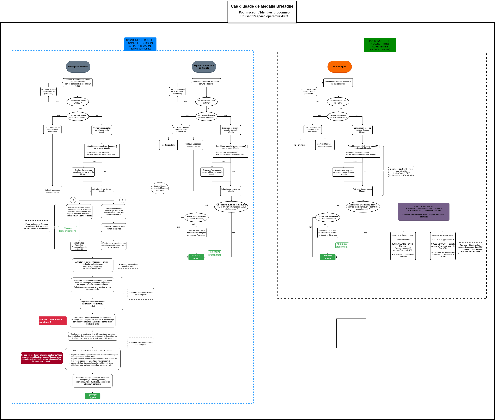

# Suite-territoriale

Ce repository contient les éléments utiles à l'implémentation de services de la suite territoriale au sein de l'infrastructure de Mégalis Bretagne

## Documentation

* un logigramme permettant de décrire les process d'activation dans le contexte Mégalis

  

